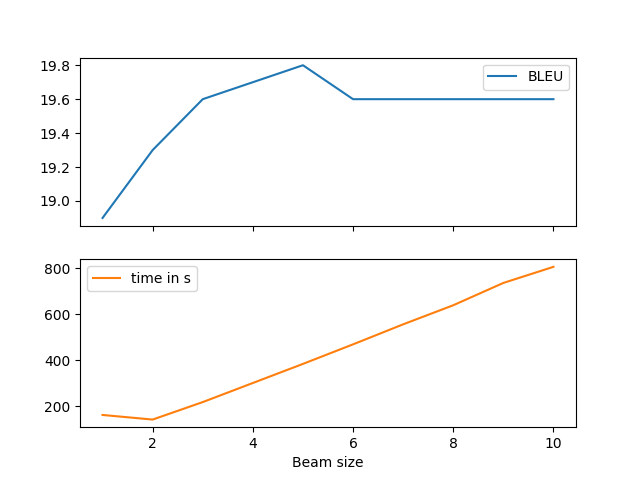

# Task 1
## Evaluation
| |use BPE|vocabulary size|BLEU|
|---|---|---|---|
|(a)|no|2000|12.3|
|(b)|yes|2000|18.5|
|(c)|yes|4000|19.8|
all done with a beam size of 5
## Task 2 - Beam size
Note: I also took the liberty of adding plot for the time it took to evaluate with different beam sizes, as I thought this was interesting

